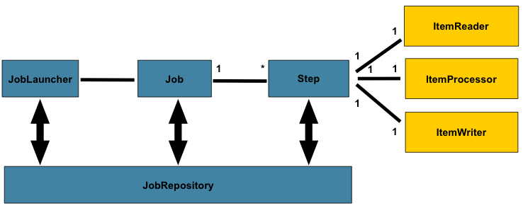
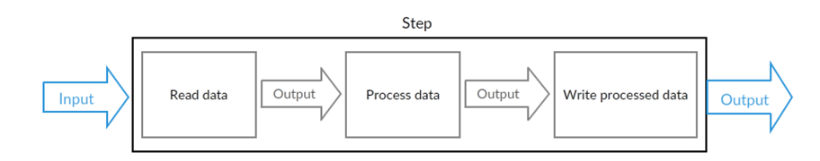

# Spring Batch

## 基础概念

### Spring Batch 简介

Spring Batch 是 Spring 提供的一个数据处理框架。企业域中的许多应用程序需要批量处理才能在关键任务环境中执行业务操作。

这些业务运营包括：

- 无需用户交互即可最有效地处理大量信息的自动化，复杂处理。这些操作通常包括基于时间的事件（例如月末计算，通知或通信）。
- 在非常大的数据集中重复处理复杂业务规则的定期应用（例如，保险利益确定或费率调整）。
- 集成从内部和外部系统接收的信息，这些信息通常需要以事务方式格式化，验证和处理到记录系统中。批处理用于每天为企业处理数十亿的交易。

> Spring Batch 是一个轻量级，全面的批处理框架，旨在开发对企业系统日常运营至关重要的强大批处理应用程序。 
> Spring Batch 构建了人们期望的 Spring Framework 特性（生产力，基于 POJO 的开发方法和一般易用性），同时使开发人员可以在必要时轻松访问和利用更高级的企业服务。
> Spring Batch 不是一个 scheduling 的框架。

Spring Batch 提供了可重用的功能，这些功能对于处理大量的数据至关重要，包括记录 / 跟踪，事务管理，作业处理统计，作业重启，跳过和资源管理。

它还提供更高级的技术服务和功能，通过优化和分区技术实现极高容量和高性能的批处理作业。

Spring Batch 可用于两种简单的用例（例如将文件读入数据库或运行存储过程）以及复杂的大量用例（例如在数据库之间移动大量数据，转换它等等）上。

大批量批处理作业可以高度可扩展的方式利用该框架来处理大量信息。

---

**Spring Batch 总体框架**



在 Spring Batch 中一个 Job 可以定义很多的步骤 step。

在每一个 step 里面可以定义：

- ItemReader 用于读取数据
- ItemProcessor 用于处理数据
- ItemWriter 用于写数据

而每一个定义的 Job 则都在 JobRepository 里面，我们可以通过 JobLauncher 来启动某一个 Job

### 批处理

**批处理**：

- 对有限数据（Finite Data）的处理

  - the data can be processed to complete

- 无需交互（No Interaction）
  
  - Interaction 的例子：Web Request（Web 请求）和 Message（发送消息）

  - Batch Processing Program run on the server without the need of interaction

- 任务是无外界中断的（No Interruption）

  - From start to end

> Non-Interactive application can consider using Batch Processing.
>
> Spring Batch is one of the solution.

一个典型的批处理应用程序大致如下：

- 从数据库，文件或队列中读取大量记录。
- 以某种方式处理数据。
- 以修改之后的形式写回数据。



### Job

**Job**：

- `Job` defines what a job is and how it is to be executed.

- `JobInstance` 是一个逻辑单位，表示 `Job` 的实例化对象。每次运行 `Job` 都会生成一个 `JobInstance` 。

- `JobExecution` 就是 `JobInstance` 的实际 尝试执行。Each `JobInstance` can have multiple executions .

How is one `JobInstance` distinguished from another? The answer is `JobParameters`.

**A `JobParameters` object holds a set of parameters used to start a batch job.**

`JobParameters` 可以是时间参数，比如今天执行了时间参数为 2023-03-28 的 job 之后（且状态为已完成），如果第二天还要执行时间参数为 2023-03-28 的 job 就会提示已经完成了。

<u>判断一个 Job 是否要执行，就是看 `JobParameters` 和 status（完成状态）。</u>

---

假设一个 `JobInstance` 在执行 `JobParameters` 为 2023-03-28 的 job 时失败了，此时算作一个 `JobExecution` 。

等下次再执行相同的 `JobParameters` 为 2023-03-28 的 job 时，a new `JobExecution` is created.

However, there is still only one `JobInstance`.

### Step

`Job` 是由一个个 `Step` 构成。

A `Step` contains all of the information necessary to define and control the actual batch processing.

---

Step 分类：

- Tasklet
  
  - an interface with one execute() method
  
  - 直接执行

- Chunk-based
  
  - 定义：item-based to process the item one by one
  
  - 步骤 1：`ItemReader` 用于 input（输入数据、读取数据）
  
  - 步骤 2：`ItemProcessor` 用于 processing (optional)（处理数据）
  
  - 步骤 3：`ItemWriter` 用于 output（输出数据）

---

`StepExecution` represents a single attempt to execute a `Step`.

A new `StepExecution` is created each time a `Step` is actually started, similar to `JobExecution`. 

### ExecutionContext

An ExecutionContext（执行上下文）represents <u>a collection of key/value pairs</u> that are persisted and controlled by the framework in order to allow developers a place to store persistent state.

There is at least one ExecutionContext per `JobExecution` and one for every `StepExecution`.

对于 `StepExecution` 而言，在每次 commit point 的时候才去持久化。假设设置了每读取 100 行做一次操作，那么这个 commit point 就是读取 100 行。

而 `JobExecution` 在每次 `StepExecution` 都会持久化。

### JobRepository

JobRepository 是 Job 的持久化机制。

When a `Job` is first launched, a `JobExecution` is obtained from the repository, and, during the course of execution, `StepExecution` and `JobExecution` implementations are persisted by passing them to the repository.

也就是说，JobRepository 是将 `JobExecution` 和 `StepExecution` 的执行进行持久化（存入数据库等）的机制

### JobLauncher

`JobLauncher` is a simple interface for launching a `Job` with a given set of `JobParameters`.

定义某个 `Job` 在某个 `JobParameters` 的情况下执行，生成 `JobExecution`：

```java
public interface JobLauncher {
    JobExecution run(Job job, JobParameters jobParameters ) throws JobExecutionAlreadyRunningException, JobRestartException, JobInstanceAlreadyCompleteException, JobParametersInvalidException;
}
```

### ItemReader, ItemProcesser and ItemWriter

`ItemReader` is used to retrieve the input data for a `Step` <u>one item at a time</u>.

`ItemProcesser` 用于处理数据。

`ItemWriter` is used to output data for a `Step` <u>one batch or chunck of items at a time</u>.

### Job Flow

Job Flow 是多个 Step 的集合，并定义了多个 Step 之间的关系，用于控制多个 Step 的执行顺序。

使用 Flow 的主要目的是复用 -- Flow can be reused within a `Job`

### Split

使用 Split 可以并发地执行多个 Flow (Execute multiple flows in parallel)

### JobExecutionDecider

`JobExecutionDecider` （决策器）可以主动地控制状态流转。

如果没有 `JobExecutionDecider` ，那么它是通过 Step 返回的 `ExitStatus` 来控制流程的。

如果 implements 了 `JobExecutionDecider` 接口，那么它通过重写 `public FlowExecutionStatus decide(JobExecution jobExecution, StepExecution stepExecution)` 方法来返回自定义的 `FlowExecutionStatus` ，以此来控制流程状态。

### Nested Job

One `Job` can be nested in another `Job`. We call the nested job the child job, while the nesting job the parent job.

The child job will not execute separately but be launched by the parent job.

注意：Nested Job 需要到配置文件中配置 spring.batch.job.names 为当前的 Parent Job 的 Bean，这样的话就可以指定只启动这个 Parent Job，其他的 Child Job 只会通过这个 Parent Job 来启动。

如果没有配置 spring.batch.job.names，那么 Child Job，除了被 Parent Job 启动之外，自己还会启动一次。

### Listener

Spring Batch 的监听器可以细分出多种：

- JobExecutionListener: before, after
- StepExecutionListener: before, after
- ChunkListener: before, after, error
- ItemReadListener, ItemProcessListener, ItemWriterListener: before, after, error

Listener 可以通过注解或实现接口来实现。

### ItemStream

`ItemStream` interface can be used to access `ExecutionContext` where the state is maintained.

`ExecutionContext` is a map that represents the state of a particular step. 

The `ExecutionContext` makes it possible to restart a step cause the state is persisted in the `JobRepository` .

When there is something wrong during execution, the last state will be updated to `JobRepository` .

Next time when the job runs, the last state will be used to populate the `ExecutionContext` and then can continue running from where is left last time.

`ItemStream` interface: 

- `open()` will be called at the beginning of the step and `ExecutionContext` will be populated with the value from DB
- `update()` will be called at the end of each step or transaction to update the `ExecutionContext` 
- `close()` is called when all chunk of data is done

## 参考资料

- [批处理框架spring batch基础知识介绍](https://blog.csdn.net/topdeveloperr/article/details/84337956) / 内容相同的备份：[Spring Batch 批处理框架，真心强啊！！](https://mp.weixin.qq.com/s/zTdlFKF8pPcrXrrLAMMc0w)