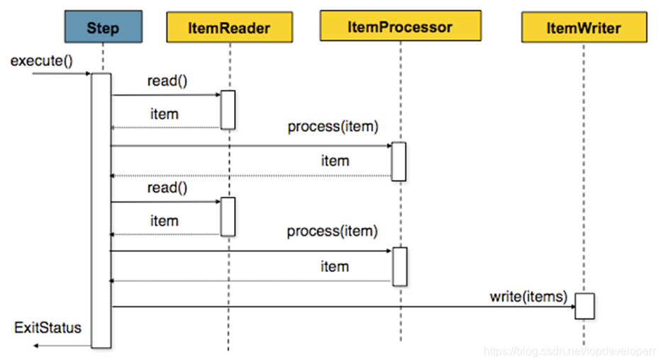

# Spring Batch

## 基础概念

### Spring Batch 简介

Spring Batch 是 Spring 提供的一个数据处理框架。企业域中的许多应用程序需要批量处理才能在关键任务环境中执行业务操作。

这些业务运营包括：

- 无需用户交互即可最有效地处理大量信息的自动化，复杂处理。这些操作通常包括基于时间的事件（例如月末计算，通知或通信）。
- 在非常大的数据集中重复处理复杂业务规则的定期应用（例如，保险利益确定或费率调整）。
- 集成从内部和外部系统接收的信息，这些信息通常需要以事务方式格式化，验证和处理到记录系统中。批处理用于每天为企业处理数十亿的交易。

> Spring Batch 是一个轻量级，全面的批处理框架，旨在开发对企业系统日常运营至关重要的强大批处理应用程序。 
> Spring Batch 构建了人们期望的 Spring Framework 特性（生产力，基于 POJO 的开发方法和一般易用性），同时使开发人员可以在必要时轻松访问和利用更高级的企业服务。
> Spring Batch 不是一个 scheduling 的框架。

Spring Batch 提供了可重用的功能，这些功能对于处理大量的数据至关重要，包括记录 / 跟踪，事务管理，作业处理统计，作业重启，跳过和资源管理。

它还提供更高级的技术服务和功能，通过优化和分区技术实现极高容量和高性能的批处理作业。

Spring Batch 可用于两种简单的用例（例如将文件读入数据库或运行存储过程）以及复杂的大量用例（例如在数据库之间移动大量数据，转换它等等）上。

大批量批处理作业可以高度可扩展的方式利用该框架来处理大量信息。

---

**Spring Batch 总体框架**


在 Spring Batch 中一个 Job 可以定义很多的步骤 step。

在每一个 step 里面可以定义：

- ItemReader 用于读取数据
- ItemProcessor 用于处理数据
- ItemWriter 用于写数据

而每一个定义的 Job 则都在 JobRepository 里面，我们可以通过 JobLauncher 来启动某一个 Job

### 批处理

**批处理**：

- 对有限数据（Finite Data）的处理

  - the data can be processed to complete

- 无需交互（No Interaction）
  
  - Interaction 的例子：Web Request（Web 请求）和 Message（发送消息）

  - Batch Processing Program run on the server without the need of interaction

- 任务是无外界中断的（No Interruption）

  - From start to end

> Non-Interactive application can consider using Batch Processing.
>
> Spring Batch is one of the solution.

一个典型的批处理应用程序大致如下：

- 从数据库，文件或队列中读取大量记录。
- 以某种方式处理数据。
- 以修改之后的形式写回数据。


### Job

在 Spring Batch 当中，job 是最顶层的抽象，除 job 之外我们还有 JobInstance 以及 JobExecution 这两个更加底层的抽象。

一个 job 是我们运行的基本单位，它内部由 step 组成。job 本质上可以看成 step 的一个容器。

一个 job 可以按照指定的逻辑顺序组合 step，并提供了我们给所有 step 设置相同属性的方法，例如一些事件监听，跳过策略。

**Job**：

- `Job` defines what a job is and how it is to be executed.

- `JobInstance` 是一个逻辑单位，表示 `Job` 的实例化对象。每次运行 `Job` 都会生成一个 `JobInstance` 。

- `JobExecution` 就是 `JobInstance` 的实际 尝试执行。Each `JobInstance` can have multiple executions .

**JobInstance**：

- JobInstance 指的是 job 运行当中，作业执行过程当中的概念
- 比如说现在有一个批处理的 job，它的功能是在一天结束时执行一次。在这个情况下，每天就会有一个逻辑意义上的 JobInstance，而我们必须记录 job 的每次运行的情况。

How is one `JobInstance` distinguished from another? The answer is `JobParameters`.

**A `JobParameters` object holds a set of parameters used to start a batch job.**

`JobParameters` 用于区分相同 Job 定义下的不同 JobInstance。


`JobParameters` 可以是时间参数，比如今天执行了时间参数为 2023-03-28 的 job 之后（且状态为已完成），如果第二天还要执行时间参数为 2023-03-28 的 job 就会提示已经完成了。

<u>判断一个 Job 是否要执行，就是看 `JobParameters` 和 status（完成状态）。</u>

**JobExecution**：

- JobExecution 指的是单次尝试运行一个我们定义好的 Job 的代码层面的概念
- Job 的一次执行可能以失败也可能成功。只有当执行成功完成时，给定的与执行相对应的 JobInstance 才也被视为完成

---

假设一个 `JobInstance` 在执行 `JobParameters` 为 2023-03-28 的 job 时失败了，此时算作一个 `JobExecution` 。

等下次再执行相同的 `JobParameters` 为 2023-03-28 的 job 时，a new `JobExecution` is created.

However, there is still only one `JobInstance`.

### Step

`Job` 是由一个个 `Step` 构成。

A `Step` contains all of the information necessary to define and control the actual batch processing.



Step 分类：

- Tasklet
  - an interface with one execute() method
  - 直接执行
- Chunk-based
  - 定义：item-based to process the item one by one
  - 步骤 1：`ItemReader` 用于 input（输入数据、读取数据）
  - 步骤 2：`ItemProcessor` 用于 processing (optional)（处理数据）
  - 步骤 3：`ItemWriter` 用于 output（输出数据）
  - 我们可以设定一个 chunk size，Spring Batch 将一条一条处理数据，但不提交到数据库，只有当处理的数据数量达到 chunk size 设定的值得时候，才一起去 commit

---

`StepExecution` represents a single attempt to execute a `Step`.

A new `StepExecution` is created each time a `Step` is actually started, similar to `JobExecution`.

每个 StepExecution 都包含对其相应步骤的引用以及 JobExecution 和事务相关的数据，例如提交和回滚计数以及开始和结束时间。 此外，每个步骤执行都包含一个
ExecutionContext，其中包含开发人员需要在批处理运行中保留的任何数据，例如重新启动所需的统计信息或状态信息。

### ExecutionContext

An ExecutionContext（执行上下文）represents <u>a collection of key/value pairs</u> that are persisted and controlled by the
framework in order to allow developers a place to store persistent state.

There is at least one ExecutionContext per `JobExecution` and one for every `StepExecution`.

对于 `StepExecution` 而言，在每次 commit point 的时候才去持久化。假设设置了每读取 100 行做一次操作，那么这个 commit point 就是读取 100 行。

而 `JobExecution` 在每次 `StepExecution` 都会持久化。

### JobRepository

JobRepository 是 Job 的持久化机制。

When a `Job` is first launched, a `JobExecution` is obtained from the repository, and, during the course of
execution, `StepExecution` and `JobExecution` implementations are persisted by passing them to the repository.

也就是说，JobRepository 是将 `JobExecution` 和 `StepExecution` 的执行进行持久化（存入数据库等）的机制。 它同时给 Job 和 Step 以及下文会提到的 JobLauncher 实现提供
CRUD 操作。

首次启动 Job 时，将从 repository 中获取 JobExecution，并且在执行批处理的过程中，StepExecution 和 JobExecution 将被存储到 repository 当中。

`@EnableBatchProcessing` 注解可以为 JobRepository 提供自动配置。

### JobLauncher

`JobLauncher` is a simple interface for launching a `Job` with a given set of `JobParameters`.

定义某个 `Job` 在某个 `JobParameters` 的情况下执行，生成 `JobExecution`：

```java
public interface JobLauncher {

  JobExecution run(Job job, JobParameters jobParameters)
          throws JobExecutionAlreadyRunningException, JobRestartException, JobInstanceAlreadyCompleteException, JobParametersInvalidException;
}
```

### ItemReader, ItemProcessor and ItemWriter

`ItemReader` is used to retrieve the input data for a `Step` <u>one item at a time</u>.

当 ItemReader 以及读完所有数据时，它会返回 null 来告诉后续操作数据已经读完。

---

`ItemProcesser` 用于处理数据。

当 ItemReader 读取到一条记录之后，ItemWriter 还未写入这条记录之前，我们可以借助 temProcessor 提供一个处理业务逻辑的功能，并对数据进行相应操作。

如果我们在 ItemProcessor 发现一条数据不应该被写入，可以通过返回 null 来表示。

---

`ItemWriter` is used to output data for a `Step` <u>one batch or chunk of items at a time</u>.

它是为每一个 step 提供数据写出的功能。写的单位是可以配置的，我们可以一次写一条数据，也可以一次写一个 chunk 的数据

### Job Flow

Job Flow 是多个 Step 的集合，并定义了多个 Step 之间的关系，用于控制多个 Step 的执行顺序。

使用 Flow 的主要目的是复用 -- Flow can be reused within a `Job`

### Split

使用 Split 可以并发地执行多个 Flow (Execute multiple flows in parallel)

### JobExecutionDecider

`JobExecutionDecider` （决策器）可以主动地控制状态流转。

如果没有 `JobExecutionDecider` ，那么它是通过 Step 返回的 `ExitStatus` 来控制流程的。

如果 implements 了 `JobExecutionDecider` 接口，那么它通过重写 `public FlowExecutionStatus decide(JobExecution jobExecution, StepExecution stepExecution)` 方法来返回自定义的 `FlowExecutionStatus` ，以此来控制流程状态。

### Nested Job

One `Job` can be nested in another `Job`. We call the nested job the child job, while the nesting job the parent job.

The child job will not execute separately but be launched by the parent job.

注意：Nested Job 需要到配置文件中配置 spring.batch.job.names 为当前的 Parent Job 的 Bean，这样的话就可以指定只启动这个 Parent Job，其他的 Child Job 只会通过这个 Parent Job 来启动。

如果没有配置 spring.batch.job.names，那么 Child Job，除了被 Parent Job 启动之外，自己还会启动一次。

### Listener

Spring Batch 的监听器可以细分出多种：

- JobExecutionListener: before, after
- StepExecutionListener: before, after
- ChunkListener: before, after, error
- ItemReadListener, ItemProcessListener, ItemWriterListener: before, after, error

Listener 可以通过注解或实现接口来实现。

### ItemStream

`ItemStream` interface can be used to access `ExecutionContext` where the state is maintained.

`ExecutionContext` is a map that represents the state of a particular step. 

The `ExecutionContext` makes it possible to restart a step cause the state is persisted in the `JobRepository` .

When there is something wrong during execution, the last state will be updated to `JobRepository` .

Next time when the job runs, the last state will be used to populate the `ExecutionContext` and then can continue running from where is left last time.

`ItemStream` interface: 

- `open()` will be called at the beginning of the step and `ExecutionContext` will be populated with the value from DB
- `update()` will be called at the end of each step or transaction to update the `ExecutionContext` 
- `close()` is called when all chunk of data is done

### @StepScope

官方文档：

- Marking a `@Bean` as `@StepScope` is equivalent to marking it as `@Scope(value="step", proxyMode=TARGET_CLASS)`

下文参考自 [Spring Batch中@StepScope的适用范围及理解](https://blog.csdn.net/lovepeacee/article/details/116003392) ：

基础知识 - IoC 容器中的几种 Bean 的作用范围：

- singleton 单例模式 – 全局有且仅有一个实例
- prototype 原型模式 – 每次获取 Bean 的时候会有一个新的实例
- request – request 表示该针对每一次 HTTP 请求都会产生一个新的 bean，同时该 bean 仅在当前 HTTP request 内有效
- session – session 作用域表示该针对每一次 HTTP 请求都会产生一个新的 bean，同时该 bean 仅在当前 HTTP session 内有效
- globalsession – global session 作用域类似于标准的 HTTP Session 作用域，不过它仅仅在基于 portlet 的 web 应用中才有意义

在 Spring Batch 中，每个 Step 里面的最底层处理单位（reader、processor、writer、tasklet 等）必须跟 Step 的生命周期保持一致，所以直接标记 `@Bean` 会导致该处理单位内的 Bean 的生命周期是整个 Spring 的周期。

使用方法如下：

```java
@Bean
@StepScope
public FlatFileItemWriter<Map> contInfoMyItemWriter(@Value("#{jobParameters['contractInfoDat']}") String contractInfoDat) {
    return getGbkFlatFileItemWriter(contractInfoDat);
}
```

注：上面的 `@Value("#{jobParameters['contractInfoDat']}")` 是用于获取执行时的 `JobParameters` 参数的 key 为 `contractInfoDat` 的值。

---

下文摘抄自 [How Does Spring Batch Step Scope Work](https://stackoverflow.com/questions/38780796/how-does-spring-batch-step-scope-work) ：

> A spring batch `StepScope` object is one which is unique to a specific step and not a singleton. As you probably know, the default bean scope in Spring is a singleton. But by specifying a spring batch component being `StepScope` means that Spring Batch will use the spring container to instantiate a new instance of that component for each step execution.
>
> This is often useful for doing parameter late binding where a parameter may be specified either at the `StepContext` or the `JobExecutionContext` level and needs to be substituted for a placeholder, much like your example with the filename requirement.
>
> Another useful reason to use `StepScope` is when you decide to reuse the same component in parallel steps. If the component manages any internal state, its important that it be `StepScope` based so that one thread does not impair the state managed by another thread (e.g, each thread of a given step has its own instance of the `StepScope` component).

## 参考资料

参考资料：

- [批处理框架spring batch基础知识介绍](https://blog.csdn.net/topdeveloperr/article/details/84337956) / 内容相同的备份：[Spring Batch 批处理框架，真心强啊！！](https://mp.weixin.qq.com/s/zTdlFKF8pPcrXrrLAMMc0w)
- [Spring Batch MyBatis](https://mybatis.org/spring/ja/batch.html)

参考代码：

- [spring-projects/spring-batch](https://github.com/spring-projects/spring-batch)
- [pkainulainen/spring-batch-examples](https://github.com/pkainulainen/spring-batch-examples)
